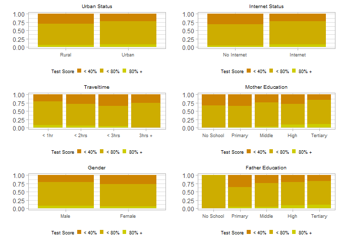
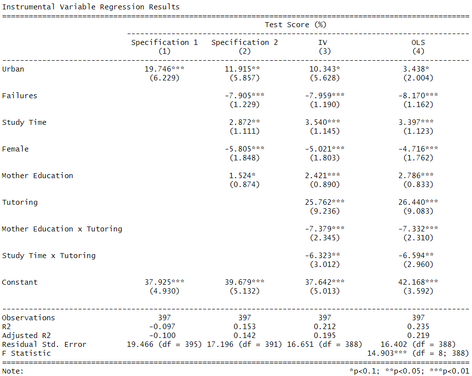
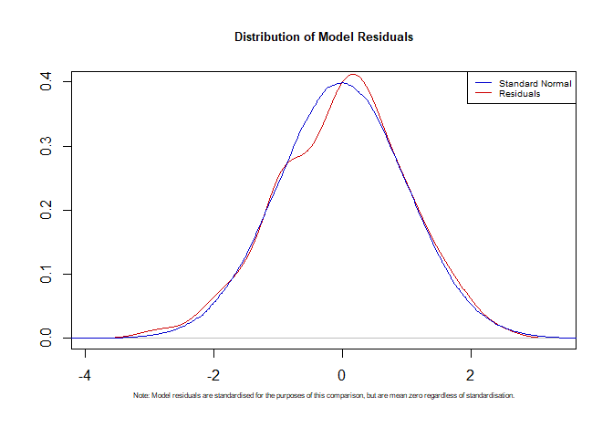

# Required Packs

-   tidyverse
-   gridExtra
-   ggplot2
-   ivreg
-   lmtest
-   stargazer

# Data Creation and Structuring

``` r
# notice the use of tidyverse %>% throughout. 

Data <- 
  
  read.csv("Data/CrossSectionData.csv") %>% 
  
  mutate(TestScores = (Test.1 + Test.2 + Test.3)/3*5) %>% 
  
  # you can also just use th sum(c(x:y)) function here but this is more readable as it tells you what columns I am manipulating. 
  
  select(  School, 
           Gender, 
           Urban.vs.Rural.Home, 
           Family.Size, 
           LiveWithParents,
           MomEdu,
           DadEdu, # this is tedious, but it is more readable
           Traveltime,
           StudyTime,
           ClassFailures,
           Tutoring,
           Internet,
           Absences,
           TestScores) %>% 
  
  # convert to dummy variables: 
  
  mutate(Gender =  as.integer(Gender == "F")) %>% 
  
  mutate(Urban.vs.Rural.Home = as.integer(Urban.vs.Rural.Home == "U")) %>% 
  
  mutate(Family.Size = as.integer(Family.Size == "LE3")) %>% 
  
  mutate(Internet = as.integer(Internet == "yes")) %>%  
  
  mutate(LiveWithParents = as.integer(LiveWithParents == "T")) %>% 

  mutate(Tutoring = as.integer(Tutoring == "yes"))

  # this is a simpler way to convert to dummy variables, although sometimes an ifelse() is required, depending on the exact problem. 
```

# Descriptive Statistics

``` r
# always write a function if you are going to repeat a process multiple times.

Average_foo <- function(x){

    Data %>%
  
  select({{x}}) %>%
  
  summarise(mean_x = mean({{x}}, na.rm = TRUE)) %>% 
  
  glimpse()
  
}

###

Average_foo(Urban.vs.Rural.Home) # 77.6% of the sample lives in urban areas. 
```

    ## Rows: 1
    ## Columns: 1
    ## $ mean_x <dbl> 0.7758186

``` r
Average_foo(Internet) # 82.9% have internet. 
```

    ## Rows: 1
    ## Columns: 1
    ## $ mean_x <dbl> 0.8287154

``` r
Average_foo(Traveltime) # 1.5 hours average travel time
```

    ## Rows: 1
    ## Columns: 1
    ## $ mean_x <dbl> 1.450882

``` r
Average_foo(Gender) # half half boy/girl
```

    ## Rows: 1
    ## Columns: 1
    ## $ mean_x <dbl> 0.5264484

``` r
Average_foo(TestScores) # 53% average test score
```

    ## Rows: 1
    ## Columns: 1
    ## $ mean_x <dbl> 53.24517

``` r
Average_foo(Tutoring) # 13% of students take up tutoring
```

    ## Rows: 1
    ## Columns: 1
    ## $ mean_x <dbl> 0.1309824

``` r
###

# below we can get the averages for different classifiers, rather than just the aggregate average as in above. 

Agg_foo <- function(Data, x, y) {
  
  x <- enquo(x) # this is dplyr functional notation. 
  y <- enquo(y)

  Data %>%
    
    group_by(!!y) %>% # the !! is also rather annoying dplyr notation. 
    
    summarise(Mean = mean(!!x, na.rm = TRUE)) %>%
    
    print()
}

# now I am able to get the specific average of any x for the different categorical values of y, in any data set with a similar structure. For example, this code says that if people have internet access == 1, their mean test score is 54.2. If internet is == 0, their mean test score is 48.4. In my write up, I used this to gather a lot of information about many variables. Here, I give only this example. 

Agg_foo(Data, TestScores, Internet)
```

    ## # A tibble: 2 × 2
    ##   Internet  Mean
    ##      <int> <dbl>
    ## 1        0  48.4
    ## 2        1  54.2

``` r
###

# the following are sort of one-time calcs so I did not feel the need to functionalise them. 

sum(Data$MomEdu <= 3 & Data$Urban.vs.Rural.Home == 0)
```

    ## [1] 70

``` r
(1 - 70/89)*100 ### only 21.34% of rural kids mothers have university.  
```

    ## [1] 21.34831

``` r
sum(Data$MomEdu <= 3 & Data$Urban.vs.Rural.Home == 1)
```

    ## [1] 195

``` r
(1 - 195/308)*100 # 36.69% of urban kids' mothers do have university.  
```

    ## [1] 36.68831

``` r
sum(Data$ClassFailures == 0 & Data$Urban.vs.Rural.Home == 0)
```

    ## [1] 63

``` r
# 26/89*100 ### 29.21% of rural kids have failed at least one class. 

sum(Data$ClassFailures == 0 & Data$Urban.vs.Rural.Home == 1)
```

    ## [1] 250

``` r
# 58/308*100 ### Only 18.83% of urban students had failed at least one class. 
```

``` r
# converting certain columns to factor variables so that I can plot stacked bar graphs for ggplot. 

Data <- 
  
  Data %>% 
  
  mutate(TestRange = as.factor(
    
    ifelse(TestScores >= 80, 2,
    ifelse(TestScores <= 40, 0, 1)))) %>% # here, ifelse() is required. 
  
  mutate(Urban = as.factor(Urban.vs.Rural.Home)) %>% 
  
  mutate(InternetCat = as.factor(Internet)) %>% 
  
  mutate(Ma = as.factor(MomEdu)) %>% 
  
  mutate(Da = as.factor(DadEdu)) %>% 
  
  mutate(Trav = as.factor(Traveltime)) %>% 
  
  mutate(Gen = as.factor(Gender))
```

``` r
source("Code/Stacked_Bars.R")

# too many parameters to write a function for the ggplots, as there can be multiple amounts of bars that would all need different labels, it was sort of quicker to just copy paste. 

grid.arrange(P1, P2, P4, P3, P5, P6)
```



# Estimating IV and OLS model(s)

``` r
# Generally, researchers and even clients are likely interested in seeing you make your point gradually. Do not overwhelm people with a full table with talk of p values and t stats. Let them gradually see how the model evolves as you add more variables, intercations, and change the estimation method between IV and OLS. 

Model1 <- lm( # normal ols
  TestScores ~ Urban.vs.Rural.Home, 
  data = Data
)

Model2 <- lm(
  TestScores ~ Urban.vs.Rural.Home + ClassFailures + StudyTime + Gender + MomEdu, 
  data = Data
)

Model3 <- ivreg( # IVREG from the IVREG package. 
  TestScores ~ ClassFailures + StudyTime + Gender + MomEdu + Tutoring + MomEdu:Tutoring + StudyTime:Tutoring| Urban.vs.Rural.Home | Internet + Traveltime, 
  data = Data)

Model4 <- lm(
  TestScores ~ Urban.vs.Rural.Home + ClassFailures + StudyTime + Gender + MomEdu + Tutoring + MomEdu:Tutoring + StudyTime:Tutoring, 
  data = Data
  )

###

# checking for model adequacy in many ways. 

residuals <- (resid(Model3) - mean(resid(Model3)))/sd(resid(Model3))
ResDens <- density(residuals) # this is for plotting 

###

ActualResids <- resid(Model3) # checking the mean of non-standardised resids

mean(ActualResids) # zero 
```

    ## [1] 1.344947e-13

``` r
###

bptest(Model4) # p value = 0.2193 (cannot reject null hypothesis of homokedasticity)
```

    ## 
    ##  studentized Breusch-Pagan test
    ## 
    ## data:  Model4
    ## BP = 10.7, df = 8, p-value = 0.2193

``` r
# Generate the table using stargazer

TABLE <- 

stargazer(Model1, Model2, Model4, Model3,
                   title = "Regression Results", 
                   table.placement = "h",
                   font.size = "small",
                   align = TRUE,
                   type = "text",
                   header = FALSE,
                   dep.var.caption = "Test Score (%)",
                   dep.var.labels.include = FALSE,
                   covariate.labels = c("Urban", 
                                        "Failures", 
                                        "Study Time", 
                                        "Female",
                                        "Mother Education",
                                        "Tutoring",
                                        "Mother Education x Tutoring", 
                                        "Study Time x Tutoring"),
                   model.names = FALSE,
                   column.labels = c("Specification 1", 
                                     "Specification 2", 
                                     "OLS", 
                                     "IV"))
```

    ## 
    ## Regression Results
    ## ===================================================================================================================
    ##                                                                 Test Score (%)                                     
    ##                             ---------------------------------------------------------------------------------------
    ##                                Specification 1        Specification 2               OLS                  IV        
    ##                                      (1)                    (2)                     (3)                  (4)       
    ## -------------------------------------------------------------------------------------------------------------------
    ## Urban                              5.028**                 3.362                  3.438*               10.343*     
    ##                                    (2.222)                (2.054)                 (2.004)              (5.628)     
    ##                                                                                                                    
    ## Failures                                                 -8.172***               -8.170***            -7.959***    
    ##                                                           (1.191)                 (1.162)              (1.190)     
    ##                                                                                                                    
    ## Study Time                                                2.649**                3.397***             3.540***     
    ##                                                           (1.078)                 (1.123)              (1.145)     
    ##                                                                                                                    
    ## Female                                                   -5.391***               -4.716***            -5.021***    
    ##                                                           (1.789)                 (1.762)              (1.803)     
    ##                                                                                                                    
    ## Mother Education                                          1.983**                2.786***             2.421***     
    ##                                                           (0.806)                 (0.833)              (0.890)     
    ##                                                                                                                    
    ## Tutoring                                                                         26.440***            25.762***    
    ##                                                                                   (9.083)              (9.236)     
    ##                                                                                                                    
    ## Mother Education x Tutoring                                                      -7.332***            -7.379***    
    ##                                                                                   (2.310)              (2.345)     
    ##                                                                                                                    
    ## Study Time x Tutoring                                                            -6.594**             -6.323**     
    ##                                                                                   (2.960)              (3.012)     
    ##                                                                                                                    
    ## Constant                          49.345***              45.379***               42.168***            37.642***    
    ##                                    (1.958)                (3.536)                 (3.592)              (5.013)     
    ##                                                                                                                    
    ## -------------------------------------------------------------------------------------------------------------------
    ## Observations                         397                    397                     397                  397       
    ## R2                                  0.013                  0.189                   0.235                0.212      
    ## Adjusted R2                         0.010                  0.178                   0.219                0.195      
    ## Residual Std. Error           18.468 (df = 395)      16.827 (df = 391)       16.402 (df = 388)    16.651 (df = 388)
    ## F Statistic                 5.118** (df = 1; 395) 18.187*** (df = 5; 391) 14.903*** (df = 8; 388)                  
    ## ===================================================================================================================
    ## Note:                                                                                   *p<0.1; **p<0.05; ***p<0.01

``` r
rm(TABLE)

# the reason that I removed the table is because, at the time, I struggled to get the table to look nice on the pdf format that the project was being submitted through. Looking back, there were other solutions. I simply screenshotted the table once it appeared in the R console, and I submitted that image by using the code chunk below to call an image. 
```

``` r
# I screenshotted the table. Stargazer does not interact well with markdown pdfs but I have since learned better table management and general alternatives to stargazer. 

knitr::include_graphics("Images/Table.png", 
                         dpi = 300)
```



# Residuals of Model

``` r
Normal <- rnorm(1000000)

###

# THE RESIDUALS ARE NORMALLY DISTRIBUTED AND MEAN ZERO. 

plot(ResDens, 
     col = "red3", 
     main = "Distribution of Model Residuals",
     ylim = c(0, 0.4),
     cex.main = 0.8, 
     xlab = "", 
     ylab = "")
lines(density(Normal), col = "blue3")
legend("topright",
       c("Standard Normal", "Residuals"), 
       col = c("blue3", "red3"), 
       lty = 1,
       cex = 0.6)
mtext("Note: Model residuals are standardised for the purposes of this comparison, but are mean zero regardless of standardisation.", side = 1, line = 2, adj = 0.5, cex = 0.5)
```



# Bibliography

Angrist, J.D. 1990. Lifetime Earnings and the Vietnam Era Draft Lottery:
Evidence from Social Security Administrative Records. *The American
Economic Review*, 80(3):313-336.

Angrist, J.D. & Pischke, J. 2008. *Mostly Harmless Econometrics*.
Princeton University Press: Oxford.

Factsheet on 2014-2022 Rural Development Programme for Mainland,
Portugal \[Online\]. \[n.d.\]. Available:
<https://agriculture.ec.europa.eu/system/files/2023-01/rdp-factsheet-portugal-continente_en.pdf>
\[10 June, 2023\].

Student Performance \[Online\]. \[n.d.\]. Available:
<https://www.kaggle.com/datasets/whenamancodes/student-performance> \[10
June, 2023\]
